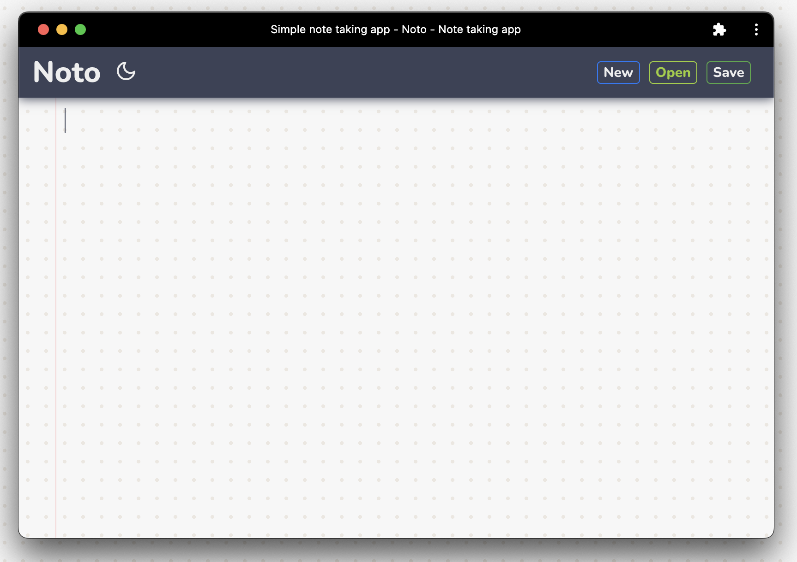

# Notepad

A modern, realtime note taking application and sharing platform built with React 19 and shadcn/ui.



## ✨ Features

- 📝 Rich text editor powered by Tiptap
- 🔄 Real-time note saving with Firebase
- 🌙 Dark mode support
- 🔐 Encrypted note sharing
- 📱 Fully responsive design
- ♿ Accessible UI components (WCAG compliant)
- ⌨️ Keyboard shortcuts support
- 🎨 Modern UI with shadcn/ui components

## 🚀 Tech Stack

- **React 19.2.3** - Latest React with improved performance
- **TypeScript** - Type-safe code
- **Vite** - Fast build tool
- **shadcn/ui** - Modern, accessible UI components
- **Tailwind CSS** - Utility-first CSS framework
- **Tiptap** - Headless rich text editor
- **Firebase** - Backend and real-time database
- **Sonner** - Toast notifications

## 📦 Installation

Before running, create a new Firebase project and add the Firebase config to the `.env` file:

```bash
npm install
```

## 🛠️ Available Scripts

### `npm run dev`

Runs the app in development mode.\
Open [http://localhost:5173](http://localhost:5173) to view it in the browser.

The page will reload if you make edits.\
You will also see any lint errors in the console.

### `npm run build`

Builds the app for production to the `dist` folder.\
It correctly bundles React in production mode and optimizes the build for the best performance.

The build is minified and the filenames include the hashes.

### `npm run lint`

Runs ESLint to check for code quality issues.

### `npm run preview`

Preview the production build locally.

## 🎯 Recent Updates

- ✅ Upgraded to React 19.2.3
- ✅ Integrated shadcn/ui for modern UI components
- ✅ Replaced all native dialogs with accessible components
- ✅ Added proper error handling throughout
- ✅ Improved code quality and type safety
- ✅ Enhanced user experience with smooth animations

## 📝 ToDo

- [x] Add Firebase
- [x] Convert the project to TypeScript
- [x] Modern UI with shadcn/ui
- [ ] Encrypt Notes (end-to-end)
- [ ] Add User Authentication
- [ ] Add User Profile
- [ ] Add User Settings
- [ ] Collaborative editing

## 📄 License

MIT
